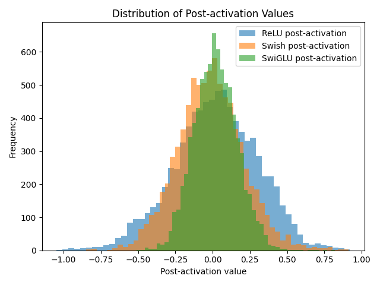

# 🔍 Transformer FFN Activation Comparison

이 프로젝트는 간단한 Transformer 인코더 기반 모델을 통해 Feedforward Network(FFN)에서 사용하는 **ReLU**, **Swish(SiLU)**, **SwiGLU** 활성화 함수의 특성과 성능, 안정성, 표현력에 미치는 영향을 시각화 실험을 통해 분석하는 실험입니다.

---

## 🧪 실험 목적

- **ReLU**는 간단하고 널리 쓰이지만, 음수 정보를 모두 잘라내기 때문에 정보 손실과 dead neuron 문제가 발생할 수 있습니다.
- **Swish(SiLU)**는 부드러운 곡선과 음수 허용 특성을 갖고 있어, ReLU보다 매끄럽고 안정적인 학습을 기대할 수 있습니다.
- **SwiGLU**는 Swish를 기반으로 곱셈 구조를 결합한 **비단조 함수(non-monotonic function)**로, Transformer FFN에서의 성능 향상에 대한 보고가 많습니다.

본 프로젝트는 다음을 증명하기 위한 목적을 갖고 있습니다:
1. SwiGLU는 ReLU에 비해 **작은 음수 값**을 허용하여 정보 손실을 줄인다.
2. SwiGLU는 **부드러운 곡선**을 가지고 있어 weight 변화에 민감하지 않고 안정적이다.
3. SwiGLU는 **비단조성(non-monotonicity)** 덕분에 더 표현력이 높다.
4. 실제로 **유용한 pre-activation 값의 분포가 Swish의 bump 영역에 많이 몰려 있다**.

---

## 🛠️ 모델 및 실험 설정

| 항목 | 설정 |
|------|------|
| 모델 | Transformer Encoder (1-layer, FFN 포함) |
| 임베딩 차원 | 64 |
| FFN 차원 | 128 |
| 데이터셋 | SST-2 (GLUE benchmark) |
| 입력 길이 | 32 토큰 |
| 토크나이저 | `bert-base-uncased` |
| Optimizer | AdamW |
| 학습률 | 1e-4 |
| Epoch 수 | 10 |
| 배치 크기 | 16 |

---

## 🧠 비교한 활성화 함수들

| 이름 | 수식 및 특징 |
|------|--------------|
| ReLU | \(\text{ReLU}(x) = \max(0, x)\)   - 단조 함수, 음수 제거 |
| Swish (SiLU) | \(\text{Swish}(x) = x \cdot \sigma(x)\)   - 부드러운 곡선, 비선형성 |
| SwiGLU | \(\text{SwiGLU}(x_1, x_2) = \text{Swish}(x_1) \cdot x_2\)   - Swish + 곱셈 구조, 비단조성 증가 |

---

## 📊 시각화 결과

### 🔹 1. Post-Activation 분포

각 활성화 함수의 FFN 출력값 분포입니다.

  

- ReLU는 0 이상 양수에 치우친 **희소 분포**
- Swish와 SwiGLU는 **부드럽고 연속적인 분포**, 특히 SwiGLU는 균형 잡힌 분포

---

### 🔹 2. Loss 수렴 비교

  

- **SwiGLU가 가장 빠르게 수렴**하며 안정적인 학습 진행
- Swish는 수렴이 느리고 ReLU는 중간 정도

---

### 🔹 3. Accuracy 추이

  

- 최종 정확도 기준: **SwiGLU > Swish ≒ ReLU**
- SwiGLU는 **빠르고 안정적으로 정확도 상승**

---

### 🔹 4. Gradient Norm 변화

각 함수의 학습 중 Gradient 흐름의 안정성을 보여줍니다.

#### 🔸 ReLU

  

- 큰 진폭과 불안정한 흐름 → Dead neuron 가능성

#### 🔸 Swish

  

- ReLU보다는 부드럽지만 여전히 진폭 차이가 큼

#### 🔸 SwiGLU

  

- **가장 안정적인 gradient 흐름**
- 지속적으로 일정한 학습 신호가 전달됨

---

### 🔹 5. Pre-activation 분포 (음수 포함)

  

- ReLU는 0 이하 값이 거의 없음 (정보 손실)
- Swish/SwiGLU는 **음수 값 허용 → 정보 보존 가능**

---

### 🔹 6. Swish의 bump 구간

  

- SwiGLU는 이 bump 영역을 활용하여 **비단조성 + 표현력 강화** 효과

---

## 📌 실험 결과 요약

| 항목 | ReLU | Swish | SwiGLU |
|------|------|--------|--------|
| 정확도 | 보통 | 보통 | **높음** ✅ |
| Loss 수렴 속도 | 보통 | 느림 | **빠름** ✅ |
| Gradient 흐름 | 불안정 | 중간 | **안정적** ✅ |
| 표현력 | 낮음 | 좋음 | **가장 우수함** ✅ |
| 음수 정보 유지 | ❌ 없음 | ✅ 일부 | ✅ 풍부 |

---

## 🧾 결론

SwiGLU는 FFN의 활성화 함수로서,
- **정보 보존력**
- **gradient 안정성**
- **표현력 향상**
- **정확도 개선**

모든 측면에서 우수한 성능을 보이며,  
Transformer 구조에서 **ReLU보다 우월한 대안**임을 확인했습니다.

---

## 📁 주요 파일

- `swiglu_test.py`: 실험 전체가 포함된 파이썬 스크립트
- `.png`: 결과 시각화 파일들
- `README.md`: 현재 문서

---

## 🔗 참고 문헌

- [GLU Variants Improve Transformer](https://arxiv.org/abs/2002.05202)
- [SilU (Swish)](https://pytorch.org/docs/stable/generated/torch.nn.functional.silu.html)
